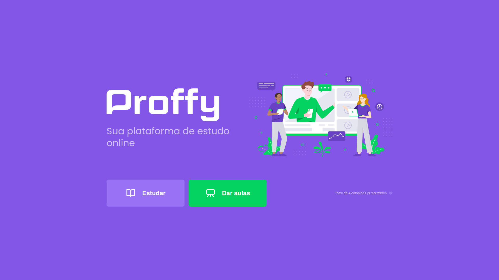
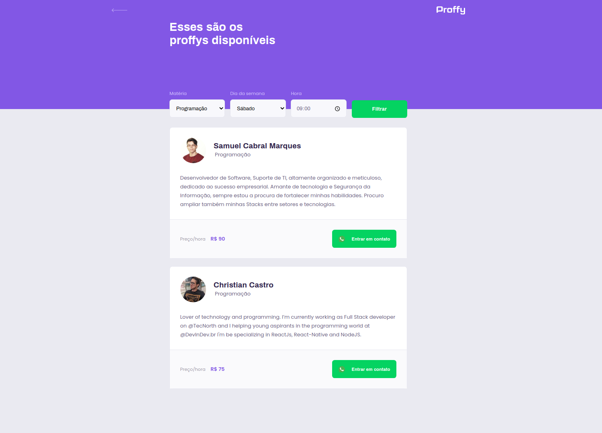

<p align="center">
  
</p>

<div align="center">

[](https://github.com/guilhermecapitao/proffy-discovery/stargazers)<space> <space>[](https://github.com/ccastro01/proffy_discovery-NLW-2/network)

</div>

## 📋 Índice

- [Sobre](#-Sobre)
- [Tecnologias utilizadas](#-Tecnologias-utilizadas)
- [Como executar o projeto](#-Como-executar-o-projeto)
- [Preview](#-Preview)

---

## 🖥 Preview 

<p align="center">
  
  
  
</p>

---

## 📖 Sobre 

Este é um projeto desenvolvido durante a **[Next Level Week](https://nextlevelweek.com/)**, realizada pela **[@Rocketseat](https://github.com/Rocketseat)** durante os dias 3 a 9 de Agosto de 2020.

A proposta do projeto é uma aplicação que possa ligar quem deseja aprender, com quer ensinar. É possível encontrar alunos para o que você leciona, ou encontrar o professor para aquela matéria que você sempre quis aprender mais! Sem que haja nenhuma limitação de área!! 

--- 

## 🚀 Tecnologias utilizadas

O projeto está desenvolvido utilizando as seguintes tecnologias:

- HTML
- CSS
- JavaScript
- Node.js 
- Nunjucks 
- SQLite 

--- 

## ⌨ Como executar o projeto

```bash
# Clonar o repositório
git clone https://github.com/CCastro01/proffy_discovery-NLW-2

# Entrar no diretório
cd proffy-discovery

# Baixar as dependências
npm install

# Executar o servidor
npm run dev
```

Feito isso, abra o seu navegador e acesse `http://localhost:5500/`

---


Desenvolvido com 💜 por Christian castro